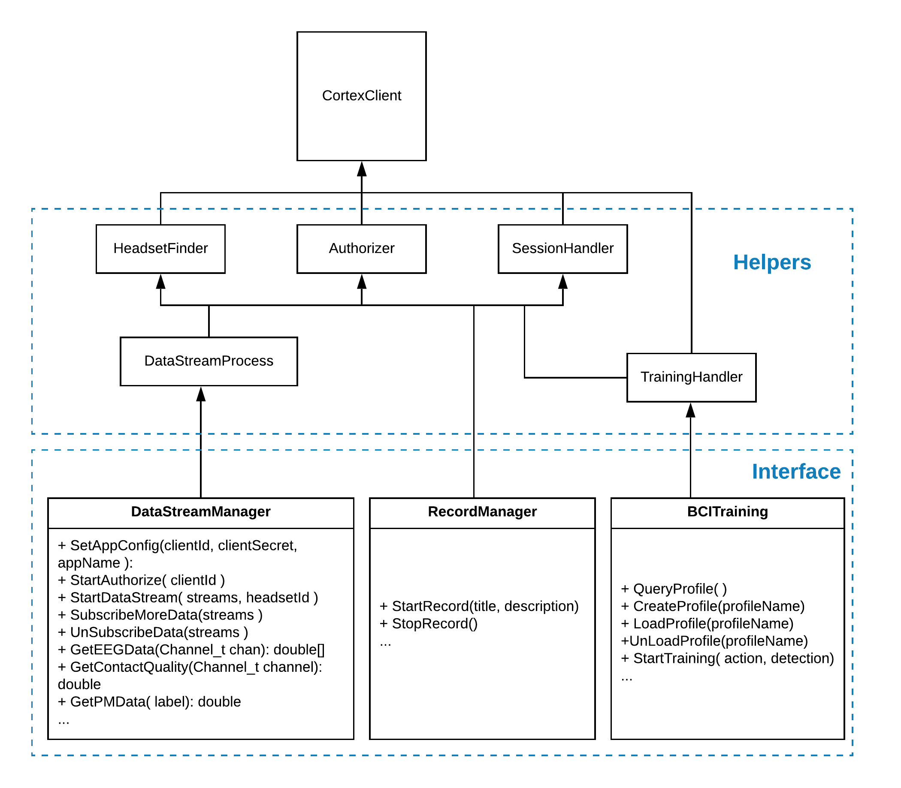

# Emotiv Unity Plugin

Here is the plugin for Unity application to work with Emotiv Cortex Service (aka Cortex).

## Prerequisites

1. [Download and install](https://www.emotiv.com/developer/) the EMOITV App with Cortex service, which is currently available for Windows and macOS.

1. Install Unity. You can get it for free at [unity3d.com](https://unity3d.com/get-unity/download).

## Setting up

You can clone the repo manually or add the plugin as a submodule of your project.
For example:
```
git submodule add https://github.com/Emotiv/unity-plugin.git /Assets/Plugins/Emotiv-Unity-Plugin
```
Please refer to the [Unity example](https://github.com/Emotiv/cortex-v2-example/tree/master/unity).

## Code structure
Here is the structure of the plugin:

<p align="center">
  
</p>

There are 3 classes as interface role. Your application will call public methods of those interfaces to work with Cortex. The CortexClient will build request messages and communicate with Cortex. The others are helper classes. 

**DataStreamManager**: Responsible for managing data streams subscription.

**RecordManager**: Responsible for handling records and markers.

**BCITraining**: Responsible for brain–computer interface (BCI) training including Mental Commands and Facial Expression.

**Authorizer**: Responsible for authorization process and Cortex token management.

**SessionHandler**: Responsible for handling sessions and records.

**HeadsetFinder**: Responsible for finding headsets.

**DataStreamProcess**: Process data streaming from Cortex.

**Logger**: Log handler will print log to file with date time prefix format. Currently, the log files are only created in standalone app mode. 
They are located at "%LocalAppData%/UnityApp/logs/" on Windows, or "~/Library/Application Support/UnityApp/logs" on macOS by default. You also can configure the log directory at Config.cs.

**CortexClient**: Create a websocket client, and build request messages to work with Cortex.

In addition, after subscribing eeg, motion, dev or pm data successfully, the plugin will create corresponding data buffers to keep data return from Cortex. You can set the windows size and step size for reading data from the buffers.

## How to use

1. Setup clientId, clientSecret, appName, appVersion for identifying application.
2. Start authorization procedure: start connecting Cortex then authorize to get token to work with Cortex. After authorizing successfully, the plugin will find headsets automatically.
3. Start data streaming: create and activate a session with a headset and subscribe to particular data streams.
4. You can subscribe or unsubscribe different data streams, and perform other tasks such as recording and training.

```
// setup App configuration
DataStreamManager.Instance.SetAppConfig("clientId_Of_App", "clientSecret_Of_App", "1.0.0", "UnityApp");
// start connect and authorize
DataStreamManager.Instance.StartAuthorize();

// ... 
// authorize successfully then find headsets

// creating session and subscribe data
List<string> dataStreamList = new List<string>(){DataStreamName.DevInfos};
DataStreamManager.Instance.StartDataStream(dataStreamList, "headsetId);

// You also can suscribe more data
DataStreamManager.Instance.SubscribeMoreData(new List<string>(){DataStreamName.EEG, DataStreamName.Motion});

// Or unsubscribe data
DataStreamManager.Instance.UnSubscribeData(new List<string>(){DataStreamName.EEG, DataStreamName.Motion});

// Or start a record
RecordManager.Instance.StartRecord("record title", "record description")

// Or start a training. You have to subscribe "sys" and "com" for mental command or "fac" for facial expression
BCITraining _bciTraining = new BCITraining();
_bciTraining.Init();
_bciTraining.GetDetectionInfo();
_bciTraining.QueryProfile();
_bciTraining.LoadProfile(profileName); // load a existed profile or create a new one
//... Do some training

```

For more details please refer to [Unity example](https://github.com/Emotiv/cortex-v2-example/tree/master/unity) 
and [Cortex-API](https://emotiv.gitbook.io/cortex-api/)
## Release Notes

See <a href="Documentation/ReleaseNotes.md">here</a>.

## License

This project is licensed under the MIT License - see the [LICENSE.md](LICENSE.md) file for details


